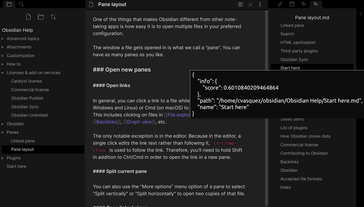

# Obsidian lab plugin

Say you have a terrific script to:

- Find similar notes to the current one.
- Translate a text.
- Know what was your mood the last three months, just reading your Obsidian vault.
- Whatever wonder you have under the sleeve :D

And you want to see if it's helpful in Obsidian without having to write a plugin.

That is the purpose of this plugin!. 

It's a plugin that calls a web app that executes the script, and then the results are shown in Obsidian

## Why this plugin? Why not program all in Javascript?

Unfortunately, the universal web language, JavaScript, doesn't have a mature suite of data science libraries, particularly Natural Language Processing.
Sometimes, it is quicker to experiment in, for example, Python, and later, if you want, make it work in Javascript.

## Status

This is still a proof of concept, expect bugs

## Requirement

Install and run a web server, such as [obsidian-lab-py](https://github.com/cristianvasquez/obsidian-lab-py), that exposes python scripts.

Perhaps someone else wants to do one using javascript, rust, or whatever? :D

## How it works?

1. The plugin makes a call using POST.

> POST: http://127.0.0.1:5000/scripts/some_list

```json
{
  "vaultPath": "/home/cvasquez/obsidian/development",
  "notePath": "snippets-plugin/Test1.md"
}
```
And gets a JSON response

> Response

```json
{
  "contents": [
    {
      "info": { "score": "0.9820077811564822" },
      "path": { "path": "/path/to/the/note 1.md" }
    },
    {
      "info": { "score": "0.9365154046414078" },
      "path": { "path": "/path/to/the/note 2.md" }
    }
  ]
}
```

2. The plugin panel is populated with the JSON response.



## Config

Configuring the plugin currently is done via de settings, where you specify what is triggered, how is it shown, 
etc...

TODO: Explain this.

## Build

is built like all the other plugins,

1. Clone this repo into

/{vault}/.obsidian/plugins

2. Install the dependencies

```
yarn install
```

3. build the app

```
yarn build
```

This will build the main file; that Obsidian should detect. Activate the plugin from inside Obsidian, in community plugins

# Developer log

## Mar 28: POC, Get similar notes to the current one.

- [x] Proof of concept
- [x] Run commands directly
- [x] Python example.
- [x] Javascript example.

## Apr 1: Multiple experiments

- [x] Multiple experiments
- [x] Text panel
- [x] Result list panel
- [x] Experiment commands

## Apr 5: HTTP Calls

- [x] HTTP calls
- [x] Python plugin system
- [x] Add text handler
- [x] Readme

## Apr 6: Command line

- [X] Parametrized python server

## Apr 7: Split in two

- [X] Splitted into plugin and [server](https://github.com/cristianvasquez/obsidian-lab-py) repos

## Apr 8: Settings

- [X] Add settings
  
## Apr 9: Application state

- [X] Refactor

## TODO

- [ ] Add graph clustering handler
