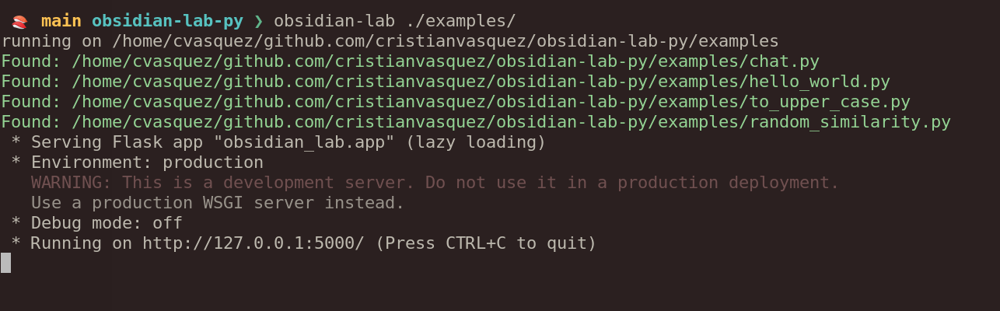
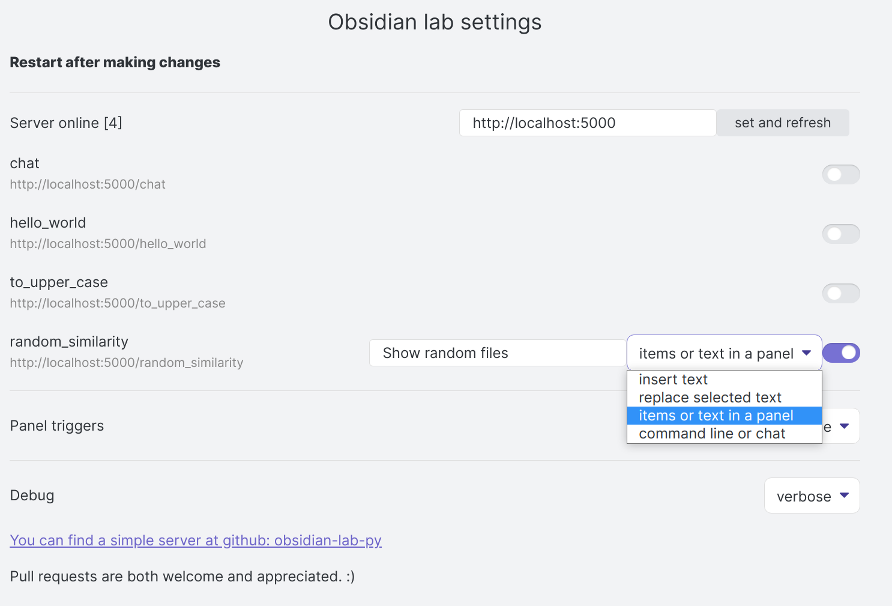
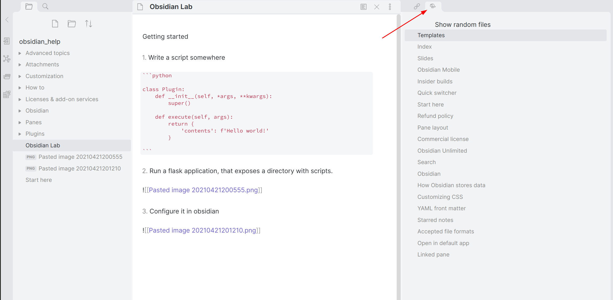
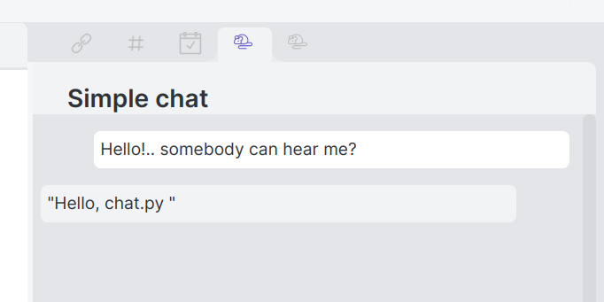

# Obsidian Python lab plugin

The Obsidian Python lab is just a collection of dumb interfaces to enable python developers to use/test functionality within Obsidian. 

## Motivation

Say you have a terrific script to:

-   Find similar notes to the current one.
-   Translate a text.
-   Write the summary of a note.
-   ....

And you want to see if it's helpful in Obsidian, just using some python.

That is the purpose of this plugin!. 

There is a server [obsidian-lab-py](https://github.com/cristianvasquez/obsidian-lab-py) that exposes and executes the scripts. This plugin is the part that shows results in Obsidian. 

## Why this plugin? Why not program all in Javascript?

Sometimes is quicker to experiment in Python and later, if you want, make it work in Javascript; This is especially true when using Natural Language Processing libraries.

## Forum

This repo has github [discussions](https://github.com/cristianvasquez/obsidian-lab/discussions) enabled.

## Status

This is still a proof of concept, expect bugs.

## Quickstart

1. Install the plugin. (Maybe you already did)

2. Write a script somewhere (or copy one of the [examples](https://github.com/cristianvasquez/obsidian-lab-py/tree/main/examples) )

```python
class Plugin:
    def __init__(self, *args, **kwargs):        
        super()

    def execute(self, args):
        return {
            'contents': f'Hello world!'
        }
```

3. Run a [flask application](https://github.com/cristianvasquez/obsidian-lab-py), that exposes the script.



4. Activate the script in the settings tab / restart



5. Use it!




## Interaction

Currently, there are four ways of interaction implemented:

1. Insert text.
2. Replace text.
3. Show elements in a panel.
4. A chat or command line.



## How it works?

1.  The plugin makes a call using POST.

> POST: <http://127.0.0.1:5000/scripts/some_list>

```json
{
  "vaultPath": "/home/cvasquez/obsidian/development",
  "notePath": "snippets-plugin/Test1.md"
}
```

And gets a JSON response.

> Response

```json
{
  "contents": [
    {
      "info": { "score": "0.9820077811564822" },
      "path": { "path": "/path/to/the/note 1.md" }
    },
    {
      "info": { "score": "0.9365154046414078" },
      "path": { "path": "/path/to/the/note 2.md" }
    }
  ]
}
```

2.  An obsidian widget is populated with the JSON response.

## Config

Currently, configuring the plugin is done via the settings and can only work when the server is up. Here you specify the service's names and how it interacts with the user. Any change in the options will persist in the plugin configuration. 

## Build

is built like all the other plugins,

1.  Clone this repo into

/{vault}/.obsidian/plugins

2.  Install the dependencies

    yarn install

3.  build the app

    yarn build

This will build the main file; that Obsidian should detect. Activate the plugin from inside Obsidian, in community plugins

# Developer log

## Mar 28: POC, Get similar notes to the current one.

-   [x] Proof of concept
-   [x] Run commands directly
-   [x] Python example.
-   [x] Javascript example.

## Apr 1: Multiple experiments

-   [x] Multiple experiments
-   [x] Text panel
-   [x] Result list panel
-   [x] Experiment commands

## Apr 5: HTTP Calls

-   [x] HTTP calls
-   [x] Python plugin system
-   [x] Add text handler
-   [x] Readme

## Apr 6: Command line

-   [x] Parametrized python server

## Apr 7: Split into two

-   [x] Splitted into plugin and [server](https://github.com/cristianvasquez/obsidian-lab-py) repos

## Apr 8: Settings

-   [x] Add settings

## Apr 9: Application state

-   [x] Refactor

## Apr 12: Review before publishing

-   [x] Refactor

## Apr 21: Add chat view

-   [x] Add chat and command view.

## Apr 22: Add icons

-   [X] Choose icons for the services.

# Contributing

Pull requests are both welcome and appreciated.

> I love coffee, you can send me one here: <https://www.buymeacoffee.com/pelado> :D
